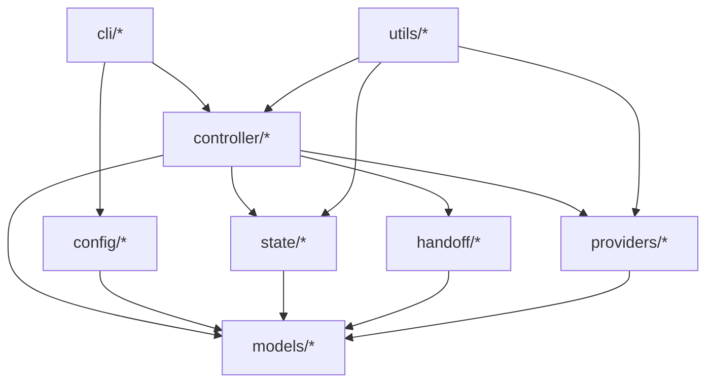

# CouncilFlow 架构设计

## 1. 架构目标

### 1.1 产品定位
`CouncilFlow` 是一个 **CLI-first、本地优先、主控感知** 的多模型协作 sidecar 工具。

它不是浏览器产品，不是本地后端平台，也不是一个新的 AI 聊天前台。它的目标是：**增强当前主控 AI 的工作能力，让 Codex、Claude Code 或 Gemini CLI 在需要时能够丝滑地调用其他模型参与讨论、分工执行和结果收敛。**

一句话定义：

> `CouncilFlow` 是给 `Codex`、`Claude Code` 和 `Gemini CLI` 使用的多模型协作 sidecar，当前会话里的主控 AI 负责总体流程，`CouncilFlow` 只在需要其他模型参与时被调用。

### 1.2 当前阶段定位
当前阶段目标不是继续构建重后端产品，而是重构成一个极简可用的本地 CLI 工具。该工具需要：

- 和现有 `project-*` 开发工作流并存
- 支持 `Codex`、`Claude Code` 与 `Gemini CLI` 作为三主控
- 只在真正需要额外模型参与时才激活 sidecar
- 通过本地文件保存权威状态，而不是数据库或常驻后端

### 1.3 架构原则

1. **Controller-first**：当前主控始终保有最终流程决策权。
2. **CLI-first**：所有核心能力都通过 CLI 完成。
3. **Local-first**：本地文件是唯一权威状态源。
4. **No hidden context sharing**：不依赖跨模型共享隐式聊天上下文。
5. **Explicit handoff**：所有跨模型协作都通过结构化 handoff package 完成。
6. **Minimal infrastructure**：不引入 Web UI、数据库、队列、常驻 API。
7. **On-demand sidecar**：只有非主控模型真正参与时才调用 `CouncilFlow`。
8. **Language-stable surface**：命令与参数统一英文，输出语言可配置。

## 2. 技术选型分析

### 2.1 推荐技术栈
- Python 3.13
- Typer
- Pydantic v2
- PyYAML
- JSON / Markdown / YAML
- subprocess + 官方 CLI 优先

### 2.2 选择理由

#### Python
优点：
- 最适合快速实现本地 CLI 编排器
- 调用外部 CLI、处理本地文件和结构化配置都很自然
- 足以支撑 v1 的多模型 sidecar，而不会引入过度工程化

备选：
- TypeScript / Node.js
- Go
- Rust

当前不选理由：
- Node 对 npm 分发友好，但当前优先级是快速迭代和低心智负担
- Go / Rust 在 v1 阶段开发速度和变更成本都更高

#### Typer
优点：
- 比 argparse 更适合构建多命令 CLI
- 可读性高，便于后续扩展 `council discuss / delegate / status`
- 易测试、易维护

备选：
- argparse
- Click

当前不选理由：
- argparse 过于底层
- Click 能力够，但 Typer 对现代 Python CLI 的开发体验更好

#### Pydantic
优点：
- 适合定义配置、讨论记录、交接包、运行记录等结构化对象
- 保证跨模块输入输出清晰稳定

备选：
- dataclasses
- attrs

当前不选理由：
- dataclasses 更轻，但对 v1 中大量结构化 handoff 和 config 校验不够稳

### 2.3 外部模型接入策略
`CouncilFlow` 采用：`CLI-first, API-optional`。

含义：
- 优先接入 `codex-cli`、`claude-code-cli`、`gemini-cli`
- API 主要用于 advisor 类补充路径
- 主控模型若就是当前环境本身，则直接原生执行，不经由 sidecar

## 3. 推荐目录结构

```text
councilflow/
├─ pyproject.toml
├─ README.md
├─ src/
│  └─ councilflow/
│     ├─ __init__.py
│     ├─ cli/
│     │  ├─ __init__.py
│     │  ├─ app.py
│     │  ├─ discuss.py
│     │  ├─ delegate.py
│     │  ├─ status.py
│     │  └─ synthesize.py
│     ├─ config/
│     │  ├─ __init__.py
│     │  ├─ loader.py
│     │  └─ schema.py
│     ├─ controller/
│     │  ├─ __init__.py
│     │  ├─ host_context.py
│     │  ├─ discussion_orchestrator.py
│     │  ├─ delegation_orchestrator.py
│     │  └─ routing.py
│     ├─ providers/
│     │  ├─ __init__.py
│     │  ├─ base.py
│     │  ├─ codex_cli.py
│     │  ├─ claude_code_cli.py
│     │  ├─ gemini_cli.py
│     │  └─ openai_api.py
│     ├─ state/
│     │  ├─ __init__.py
│     │  ├─ paths.py
│     │  ├─ store.py
│     │  └─ snapshots.py
│     ├─ handoff/
│     │  ├─ __init__.py
│     │  ├─ packages.py
│     │  ├─ prompts.py
│     │  └─ summaries.py
│     ├─ models/
│     │  ├─ __init__.py
│     │  ├─ roles.py
│     │  ├─ discussion.py
│     │  ├─ delegation.py
│     │  ├─ config.py
│     │  └─ run_record.py
│     └─ utils/
│        ├─ __init__.py
│        ├─ git.py
│        ├─ io.py
│        └─ lang.py
├─ tests/
│  ├─ test_cli_discuss.py
│  ├─ test_discussion_orchestrator.py
│  ├─ test_delegation_orchestrator.py
│  ├─ test_config_loader.py
│  └─ test_state_store.py
└─ docs/
   └─ architecture.md
```

### 3.1 目录职责
- `cli/`：命令入口
- `config/`：角色映射、输出语言、讨论参数配置
- `controller/`：核心编排逻辑
- `providers/`：外部模型接入
- `state/`：本地 `.council/` 状态管理
- `handoff/`：结构化交接包与摘要
- `models/`：结构化数据模型
- `utils/`：通用工具

## 4. 模块划分与职责定义

### 4.1 主控识别层：`host_context`
职责：
- 识别当前主控是 `codex`、`claude` 还是 `gemini`
- 提供统一的 `current_controller` 视图
- 输出当前语言、当前运行环境等主控上下文

关键要求：
- 主控只识别当前真实会话环境
- 不通过猜测历史状态来推断主控
- 对 `Gemini CLI` 需要提供与 `Codex` / `Claude Code` 同等级的环境信号或显式 override 契约

### 4.2 路由层：`routing`
职责：
- 根据 role mapping 决定某一步是：
  - 由主控直接执行
  - 还是调用 sidecar
- 处理 discuss 目标模型去重和无效情况

关键规则：
1. 目标角色映射到当前主控时，直接执行
2. 只有目标角色映射到非主控模型时，才委派
3. `discuss` 只在去重后仍有额外模型时才启动

### 4.3 讨论编排层：`discussion_orchestrator`
职责：
- 执行多模型讨论流程
- 管理轮次、摘要、用户插话和最终综合

讨论规则：
- `discuss` 一旦显式触发，允许进入多轮讨论
- 当是“主控 + 1 个额外模型”时，最多 5 轮
- 可提前结束，不强制跑满
- 最终结论始终由主控输出

### 4.4 委派编排层：`delegation_orchestrator`
职责：
- 把某个角色任务交给非主控模型
- 生成 handoff package
- 调用 provider adapter
- 落盘结果并返回给主控

关键原则：
- 若角色对应的是当前主控，则不进入委派层
- 若委派失败，必须返回结构化错误，不吞掉异常

### 4.5 Provider Adapter 层
统一接口建议：

```python
class ProviderAdapter(Protocol):
    def ask(self, prompt: str, context: dict[str, object]) -> ModelResponse:
        ...
```

建议实现：
- `CodexCliAdapter`
- `ClaudeCodeCliAdapter`
- `GeminiCliAdapter`
- `OpenAIChatAdapter`

职责边界：
- adapter 只负责和目标模型通信
- 不做业务决策
- 不维护权威状态

### 4.6 Handoff 层
职责：
- 生成结构化交接包
- 提供最小必要上下文
- 防止把整段长会话直接透传给别的模型

交接包最少应包含：
- `role`
- `objective`
- `task_summary`
- `constraints`
- `relevant_files`
- `inputs`
- `expected_output`

### 4.7 State 层
职责：
- 维护 `.council/` 本地权威状态
- 提供读写、快照和恢复能力

设计要求：
- 不引入数据库
- 本地文件结构既可读又可被模型消费
- 中断后可从文件恢复

## 5. 内部接口与命令设计

### 5.1 CLI 命令
建议命令集：

```text
council discuss
council delegate
council synthesize
council status
```

这些命令主要用于：
- 被主控通过 `project-*` 流程调用
- 高级用户直接手动调用

### 5.2 `council discuss`
用途：发起多模型讨论

输入示例：

```bash
council discuss \
  --question "这个架构怎么拆" \
  --models claude,gpt \
  --max-rounds 5 \
  --output-language zh-CN
```

输出结构：

```json
{
  "data": {
    "discussion_id": "disc_001",
    "controller": "codex",
    "participants": ["codex", "claude", "gpt"],
    "rounds_completed": 3,
    "ended_reason": "converged",
    "summary_path": ".council/discuss/disc_001/summary.md"
  },
  "error": null
}
```

### 5.3 `council delegate`
用途：把某个角色任务委派给非主控模型

输入示例：

```bash
council delegate \
  --role implementer \
  --model claude \
  --handoff .council/delegations/pkg_001.yaml
```

输出结构：

```json
{
  "data": {
    "delegation_id": "del_001",
    "role": "implementer",
    "model": "claude",
    "result_path": ".council/delegations/del_001/result.md"
  },
  "error": null
}
```

### 5.4 `council synthesize`
用途：
- 汇总 discuss 或 delegation 的结果
- 主要用于高级用户或自动流程复用

### 5.5 `council status`
用途：
- 查看当前 `.council/` 状态摘要
- 返回当前主控、最近讨论、最近委派和当前语言设置

## 6. discuss 协议设计

### 6.1 discuss 参数适用范围
以下 `project-*` 技能应支持 `discuss` 参数：
- `project-init`
- `project-design`
- `project-plan`
- `project-next`
- `project-review`
- `project-ask`
- `project-change`

### 6.2 discuss 触发规则
1. 默认不启动多模型讨论
2. 只有显式写了 `discuss <model>` 或 `discuss <model1,model2>` 才启动
3. 如果没有指定额外模型，则按当前主控单模型执行
4. 如果指定了额外模型，则在当前步骤前触发讨论，由主控收敛结果并继续当前步骤

### 6.3 与当前主控相同模型的讨论
规则：
- 如果 discuss 指定的模型与主控相同，则不启动跨模型讨论
- 应明确提醒用户需要指定不同模型

如果是模型列表，则：
- 自动忽略与主控重复的模型
- 去重后若为空，不调用 sidecar

### 6.4 参与者规则
一次 discuss 至少包含：
- 当前主控
- 一个或多个额外模型
- 可选的人类用户输入

### 6.5 讨论轮次规则
- 显式指定额外模型后，启动多轮讨论
- 当讨论场景是“主控 + 1 个额外模型”时，最多允许 5 轮
- 可提前结束，不强制跑满
- 不做无限轮讨论

### 6.6 提前结束规则
如果额外模型已经明确表示：
- 同意当前方案
- 没有新的实质性补充
- 没有新的异议或风险

则主控可直接结束讨论。

### 6.7 讨论流程
固定流程建议：
1. 主控 framing
2. 外部模型首轮意见
3. 可选交叉回应
4. 用户插话
5. 主控输出最终结论

### 6.8 输出格式
每次 discuss 最终至少输出：
- `question`
- `participants`
- `key_options`
- `agreements`
- `disagreements`
- `recommended_decision`
- `open_questions`
- `next_step`

## 7. 数据模型设计

```mermaid
erDiagram
    PROJECT_STATE ||--|| ROLE_MAPPING : has
    PROJECT_STATE ||--o{ DISCUSSION_RECORD : stores
    PROJECT_STATE ||--o{ DELEGATION_RECORD : stores
    PROJECT_STATE ||--o{ RUN_RECORD : stores
    DISCUSSION_RECORD ||--o{ DISCUSSION_ROUND : contains
    DELEGATION_RECORD ||--|| HANDOFF_PACKAGE : uses

    PROJECT_STATE {
        string project_root
        string output_language
        string current_controller
        string current_phase
        datetime updated_at
    }

    ROLE_MAPPING {
        string planner
        string architect
        string implementer
        string tester
        string reviewer
        string fixer
        string advisor
        string synthesizer
    }

    DISCUSSION_RECORD {
        string id
        string controller
        string question
        string status
        int max_rounds
        int completed_rounds
        string ended_reason
        datetime created_at
    }

    DISCUSSION_ROUND {
        string id
        string discussion_id
        int round_number
        string speaker_model
        string summary
        bool introduced_new_info
    }

    DELEGATION_RECORD {
        string id
        string role
        string target_model
        string status
        string result_path
        datetime created_at
    }

    HANDOFF_PACKAGE {
        string id
        string objective
        string constraints
        string inputs_path
        string expected_output
    }

    RUN_RECORD {
        string id
        string kind
        string actor
        string status
        string artifact_path
        datetime created_at
    }
}
```

## 8. 模块依赖关系



说明：
- `cli` 只负责命令入口
- `controller` 承担核心编排责任
- `providers` 只负责模型通信
- `handoff` 负责显式交接包
- `state` 负责权威本地状态
- `models` 负责协议和结构定义

## 9. 与 `project-*` 的关系

需要明确区分两层：

### 9.1 开发层
这些技能用于开发 `CouncilFlow` 本体：
- `project-init`
- `project-design`
- `project-plan`
- `project-next`
- `project-review`
- `project-discuss`

### 9.2 产品层
这些命令是 `CouncilFlow` 做成后，被主控 AI 调用的 sidecar CLI：
- `council discuss`
- `council delegate`
- `council synthesize`
- `council status`

结论：
- `project-*` 是开发工作流
- `council *` 是产品命令层
- 两者不是重复命令，而是不同层次

## 10. 关键架构决策

1. 不做 Web UI
2. 不做数据库
3. 不做常驻 API
4. 不共享隐式聊天上下文
5. 用 `.council/` 做唯一权威状态源
6. 当前主控默认直接工作
7. 只有非主控模型真正参与时才激活 sidecar
8. `discuss` 最终结论由主控输出
9. 双模型讨论最多 5 轮，可提前结束

## 11. 建议实现顺序

1. `host_context` 和 role routing
2. `.council/` 状态层
3. `council discuss`
4. `council delegate`
5. `project-discuss` skill 设计与接入
6. `project-*` 的 `discuss` 参数支持
7. `council status`
8. 输出语言与中文默认输出
9. `Gemini CLI` 主控识别与 provider 接入
10. `.workflow-core` 共享 skill 源同步到 `Codex` / `Claude Code` / `Gemini CLI`

## 12. 技术栈总结
建议技术栈：
- Python 3.13
- Typer
- Pydantic v2
- PyYAML
- JSON / YAML / Markdown
- Codex CLI
- Claude Code CLI
- Gemini CLI

## 13. 结论
`CouncilFlow` 的最终定位不是“另一个 AI 平台”，而是：

> 一个服务于 `Codex`、`Claude Code` 与 `Gemini CLI` 的、主控感知的、多模型协作 sidecar CLI。

## 14. 变更记录（2026-04-16）
本次变更将系统目标从“`Codex` + `Claude Code` 双主控”扩展为“`Codex` + `Claude Code` + `Gemini CLI` 三主控”。

新增架构要求：
1. `host_context` 必须支持 `Gemini CLI` 的主控识别策略，并保持与现有 `controller_override` 兼容。
2. `providers/` 层必须提供 `GeminiCliAdapter`，并保证 `discuss` / `delegate` / `status` 在 `Gemini CLI` 主控下的行为与现有主控保持一致。
3. `.workflow-core` 的共享 skill 源与同步脚本不再只面向 `Codex` / `Claude Code`，而是要统一覆盖三种工具侧产物。
4. 发布节奏改为分阶段推进：先完成 `Codex-first` 稳定性硬化，再接入 `Gemini CLI`，最后在 `Claude Code` 可用时完成三主控最终 gate。

本节覆盖并 supersede 文中所有“双主控”限定表述。

## 15. 变更记录（2026-04-16，全局安装与备份）
本次变更将 `.workflow-core` 从“共享 skill 源”提升为“全局 workflow 发布源”，新增一层面向用户环境的安装与回滚架构。

新增架构要求：
1. `C:\Users\David Zhai\.workflow-core\scripts` 需要提供用户级备份脚本，生成带时间戳的快照目录，覆盖共享源、三端全局 skill 目标目录和 MCP 相关配置文件。
2. `C:\Users\David Zhai\.workflow-core\scripts` 需要提供全局安装脚本，按“备份 -> 同步 skills -> 注册或校验 MCP -> 输出结果摘要”的顺序执行，且脚本应支持重复运行。
3. MCP 安装优先通过官方 CLI 完成，而不是直接手改配置文件：
   - `codex mcp add ...`
   - `claude mcp add --scope user ...`
   - `gemini mcp add --scope user ...`
4. 安装层必须把 `.workflow-core\skills\project-*` 视为唯一源，并复用现有 `sync-skills.ps1`，避免复制出第二套同步逻辑。
5. 需要明确 restore / rollback 契约，至少保证用户可依据备份目录恢复三端全局 skills 与相关 MCP 配置。
6. 验收分两层：
   - 自动层：备份成功、安装成功、三端 CLI 可列出目标 skills 与 `project-manager` MCP。
   - 人工层：三端新会话可以实际调用 `project-status` 或 `project-resume`。

范围说明：
- 本次变更聚焦 `project-*` 共享 skills 与它们所依赖的 MCP，不扩展到其它独立插件或非 workflow-core 技能。
- 现有 `sync-global-rules.ps1` 可继续作为独立能力存在，但不作为本次全局 skill 安装的强依赖。

## 16. 变更记录（2026-04-17，共享 discuss 工作流补齐）
本次变更聚焦共享 workflow 层的 discuss 能力补齐，目标是让 `.workflow-core` 中的 `project-*` skills 与 `CouncilFlow` 当前稳定实现重新对齐。

新增架构要求：
1. `.workflow-core\skills` 需要新增 `project-discuss\SKILL.md`，作为独立讨论入口；该目录仍由共享源维护，再通过现有同步链路复制到 `Codex`、`Claude Code` 与 `Gemini CLI` 的技能目录。
2. `project-init`、`project-ask`、`project-next` 需要补齐嵌入式 discuss 协议说明，并与现有 `project-design`、`project-plan`、`project-change`、`project-review` 采用同一套显式触发规则：
   - 默认不讨论
   - 只有显式 `discuss <models>` 才调用 `council discuss`
   - 与主控重复的模型由 `CouncilFlow` 自身负责提醒、忽略或短路
3. 共享 skills 读取讨论结果时必须对齐真实 artifact 契约，不再假设存在 `latest` 别名目录。标准读取顺序应为：
   - 优先使用 `council discuss` 命令返回 JSON 中的 `data.summary_path`
   - 若需要手动定位，再读取 `.council/discuss/<discussion_id>/summary.md`
4. `project-next` 中的多模型协作说明需要从“只强调 delegate”扩展为“先 discuss 做方案收敛，再按角色 delegate 执行”的完整闭环，但仍保持 discuss 为可选入口。
5. 验证层需要补一轮共享源与三端安装产物的一致性检查，至少确认：
   - `project-discuss` 已出现在共享源和三端目标目录
   - 更新后的 `project-init`、`project-ask`、`project-next` 已同步到三端
   - 旧的 `.council/discuss/latest/summary.md` 文案已从共享 skills 中清除

实现边界：
1. 本次变更只改共享 skill 文案、同步产物与相关状态文档，不扩展新的 Python 模块。
2. 继续复用现有 `sync-skills.ps1` 作为发布路径，不另起第二套同步机制。

## 17. 变更记录（2026-04-17，Claude commands 包装层）
本次变更为 `Claude Code` 引入一层**生成式 commands 包装层**，用于解决 slash 命令列表中的描述展示问题，同时保持共享 workflow 的唯一真相源仍然位于 `.workflow-core\skills\project-*`。

新增架构要求：
1. 共享源仍然只有一层：`.workflow-core\skills\project-*`。`C:\Users\David Zhai\.claude\commands\project-*.md` 只能是派生产物，不能成为第二套业务规则源。
2. `sync-skills.ps1` 需要扩展为两段式发布：
   - 同步共享 `project-*` skills 到 `Codex / Claude / Gemini` 的 `skills` 目录
   - 基于 `Claude` 侧已同步的 `skills` 自动生成 `commands\project-*.md`
3. 生成式 commands 文件至少需要包含：
   - 合法的 frontmatter `description`
   - 对应 skill 文件的明确引用
   - 参数透传入口（如 `$ARGUMENTS`）以便 slash 命令继续承载用户附加参数
4. 生成逻辑应从共享 skill 提取最小必要元数据，优先复用 skill frontmatter 中的 `description`，避免在脚本里硬编码第二份命令说明。
5. 备份/恢复架构需要把 `C:\Users\David Zhai\.claude\commands\project-*.md` 纳入受管范围；安装文档也需要明确这层是“由安装脚本自动生成”的派生产物。
6. `Codex` 与 `Gemini` 不增加对应的 commands 包装层，继续直接消费 `skills` 目录，避免无必要地扩大打包表面。

实现边界：
1. 本次变更优先修改 PowerShell 安装/同步脚本与相关文档，不要求新增新的长期驻留服务。
2. 对 `Claude Code` 的适配应保持可重复执行和可回滚，避免在用户目录中留下未受管的手工命令文件。

修复说明（2026-04-17）：
真实安装验证表明，`Claude Code` 同时暴露 `skills` 与 `commands` 两层 `project-*` 入口会造成重复 slash 条目和 frontmatter 说明回退。因此发布架构调整为：
1. `Codex` / `Gemini CLI` 继续消费同步后的 `skills` 目录；
2. `Claude Code` 仅消费由共享源自动生成的 `commands\project-*.md`；
3. 安装脚本在生成 `commands` 后，需要清理 `.claude\skills\project-*` 这组受管目录，避免双重暴露；
4. 备份与恢复仍应兼容旧快照中的 `.claude\skills\project-*`，但新安装结果不再保留这组运行时目录。
