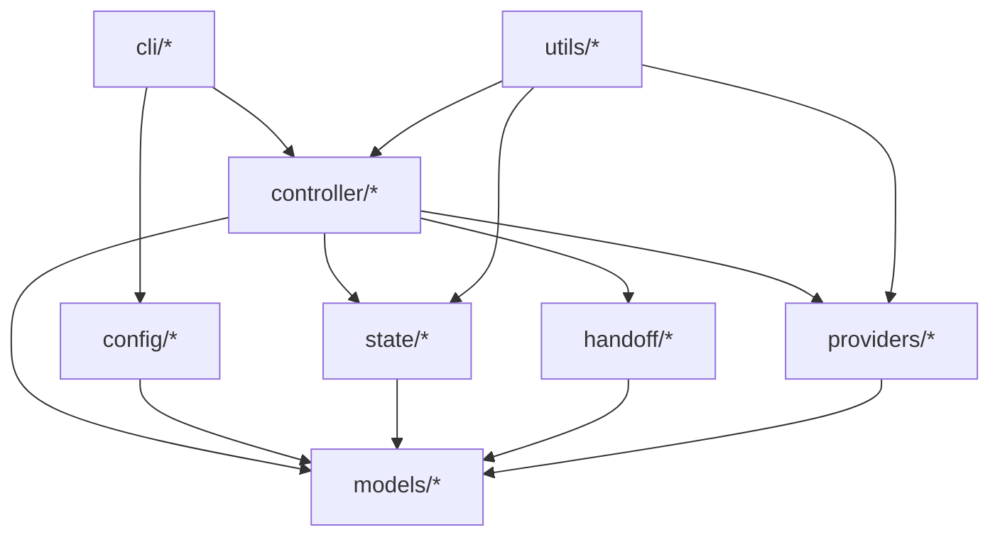

# CouncilFlow 架构设计

## 1. 架构目标

### 1.1 产品定位
`CouncilFlow` 是一个 **CLI-first、本地优先、主控感知** 的多模型协作 sidecar 工具。

它不是浏览器产品，不是本地后端平台，也不是一个新的 AI 聊天前台。它的目标是：**增强当前主控 AI 的工作能力，让 Codex、Claude Code 或 Gemini CLI 在需要时能够丝滑地调用其他模型参与讨论、分工执行和结果收敛。**

一句话定义：

> `CouncilFlow` 是给 `Codex`、`Claude Code` 和 `Gemini CLI` 使用的多模型协作 sidecar，当前会话里的主控 AI 负责总体流程，`CouncilFlow` 只在需要其他模型参与时被调用。

### 1.2 当前阶段定位
当前阶段目标不是继续构建重后端产品，而是重构成一个极简可用的本地 CLI 工具。该工具需要：

- 和现有 `project-*` 开发工作流并存
- 支持 `Codex`、`Claude Code` 与 `Gemini CLI` 作为三主控
- 只在真正需要额外模型参与时才激活 sidecar
- 通过本地文件保存权威状态，而不是数据库或常驻后端

### 1.3 架构原则

1. **Controller-first**：当前主控始终保有最终流程决策权。
2. **CLI-first**：所有核心能力都通过 CLI 完成。
3. **Local-first**：本地文件是唯一权威状态源。
4. **No hidden context sharing**：不依赖跨模型共享隐式聊天上下文。
5. **Explicit handoff**：所有跨模型协作都通过结构化 handoff package 完成。
6. **Minimal infrastructure**：不引入 Web UI、数据库、队列、常驻 API。
7. **On-demand sidecar**：只有非主控模型真正参与时才调用 `CouncilFlow`。
8. **Language-stable surface**：命令与参数统一英文，输出语言可配置。

## 2. 技术选型分析

### 2.1 推荐技术栈
- Python 3.13
- Typer
- Pydantic v2
- PyYAML
- JSON / Markdown / YAML
- subprocess + 官方 CLI 优先

### 2.2 选择理由

#### Python
优点：
- 最适合快速实现本地 CLI 编排器
- 调用外部 CLI、处理本地文件和结构化配置都很自然
- 足以支撑 v1 的多模型 sidecar，而不会引入过度工程化

备选：
- TypeScript / Node.js
- Go
- Rust

当前不选理由：
- Node 对 npm 分发友好，但当前优先级是快速迭代和低心智负担
- Go / Rust 在 v1 阶段开发速度和变更成本都更高

#### Typer
优点：
- 比 argparse 更适合构建多命令 CLI
- 可读性高，便于后续扩展 `council discuss / delegate / status`
- 易测试、易维护

备选：
- argparse
- Click

当前不选理由：
- argparse 过于底层
- Click 能力够，但 Typer 对现代 Python CLI 的开发体验更好

#### Pydantic
优点：
- 适合定义配置、讨论记录、交接包、运行记录等结构化对象
- 保证跨模块输入输出清晰稳定

备选：
- dataclasses
- attrs

当前不选理由：
- dataclasses 更轻，但对 v1 中大量结构化 handoff 和 config 校验不够稳

### 2.3 外部模型接入策略
`CouncilFlow` 采用：`CLI-first, API-optional`。

含义：
- 优先接入 `codex-cli`、`claude-code-cli`、`gemini-cli`
- API 主要用于 advisor 类补充路径
- 主控模型若就是当前环境本身，则直接原生执行，不经由 sidecar

## 3. 推荐目录结构

```text
councilflow/
├─ pyproject.toml
├─ README.md
├─ src/
│  └─ councilflow/
│     ├─ __init__.py
│     ├─ cli/
│     │  ├─ __init__.py
│     │  ├─ app.py
│     │  ├─ discuss.py
│     │  ├─ delegate.py
│     │  ├─ status.py
│     │  └─ synthesize.py
│     ├─ config/
│     │  ├─ __init__.py
│     │  ├─ loader.py
│     │  └─ schema.py
│     ├─ controller/
│     │  ├─ __init__.py
│     │  ├─ host_context.py
│     │  ├─ discussion_orchestrator.py
│     │  ├─ delegation_orchestrator.py
│     │  └─ routing.py
│     ├─ providers/
│     │  ├─ __init__.py
│     │  ├─ base.py
│     │  ├─ codex_cli.py
│     │  ├─ claude_code_cli.py
│     │  ├─ gemini_cli.py
│     │  └─ openai_api.py
│     ├─ state/
│     │  ├─ __init__.py
│     │  ├─ paths.py
│     │  ├─ store.py
│     │  └─ snapshots.py
│     ├─ handoff/
│     │  ├─ __init__.py
│     │  ├─ packages.py
│     │  ├─ prompts.py
│     │  └─ summaries.py
│     ├─ models/
│     │  ├─ __init__.py
│     │  ├─ roles.py
│     │  ├─ discussion.py
│     │  ├─ delegation.py
│     │  ├─ config.py
│     │  └─ run_record.py
│     └─ utils/
│        ├─ __init__.py
│        ├─ git.py
│        ├─ io.py
│        └─ lang.py
├─ tests/
│  ├─ test_cli_discuss.py
│  ├─ test_discussion_orchestrator.py
│  ├─ test_delegation_orchestrator.py
│  ├─ test_config_loader.py
│  └─ test_state_store.py
└─ docs/
   └─ architecture.md
```

### 3.1 目录职责
- `cli/`：命令入口
- `config/`：角色映射、输出语言、讨论参数配置
- `controller/`：核心编排逻辑
- `providers/`：外部模型接入
- `state/`：本地 `.council/` 状态管理
- `handoff/`：结构化交接包与摘要
- `models/`：结构化数据模型
- `utils/`：通用工具

## 4. 模块划分与职责定义

### 4.1 主控识别层：`host_context`
职责：
- 识别当前主控是 `codex`、`claude` 还是 `gemini`
- 提供统一的 `current_controller` 视图
- 输出当前语言、当前运行环境等主控上下文

关键要求：
- 主控只识别当前真实会话环境
- 不通过猜测历史状态来推断主控
- 对 `Gemini CLI` 需要提供与 `Codex` / `Claude Code` 同等级的环境信号或显式 override 契约

### 4.2 路由层：`routing`
职责：
- 根据 role mapping 决定某一步是：
  - 由主控直接执行
  - 还是调用 sidecar
- 处理 discuss 目标模型去重和无效情况

关键规则：
1. 目标角色映射到当前主控时，直接执行
2. 只有目标角色映射到非主控模型时，才委派
3. `discuss` 只在去重后仍有额外模型时才启动

### 4.3 讨论编排层：`discussion_orchestrator`
职责：
- 执行多模型讨论流程
- 管理轮次、摘要、用户插话和最终综合

讨论规则：
- `discuss` 一旦显式触发，允许进入多轮讨论
- 当是“主控 + 1 个额外模型”时，最多 5 轮
- 可提前结束，不强制跑满
- 最终结论始终由主控输出

### 4.4 委派编排层：`delegation_orchestrator`
职责：
- 把某个角色任务交给非主控模型
- 生成 handoff package
- 调用 provider adapter
- 落盘结果并返回给主控

关键原则：
- 若角色对应的是当前主控，则不进入委派层
- 若委派失败，必须返回结构化错误，不吞掉异常

### 4.5 Provider Adapter 层
统一接口建议：

```python
class ProviderAdapter(Protocol):
    def ask(self, prompt: str, context: dict[str, object]) -> ModelResponse:
        ...
```

建议实现：
- `CodexCliAdapter`
- `ClaudeCodeCliAdapter`
- `GeminiCliAdapter`
- `OpenAIChatAdapter`

职责边界：
- adapter 只负责和目标模型通信
- 不做业务决策
- 不维护权威状态

### 4.6 Handoff 层
职责：
- 生成结构化交接包
- 提供最小必要上下文
- 防止把整段长会话直接透传给别的模型

交接包最少应包含：
- `role`
- `objective`
- `task_summary`
- `constraints`
- `relevant_files`
- `inputs`
- `expected_output`

### 4.7 State 层
职责：
- 维护 `.council/` 本地权威状态
- 提供读写、快照和恢复能力

设计要求：
- 不引入数据库
- 本地文件结构既可读又可被模型消费
- 中断后可从文件恢复

## 5. 内部接口与命令设计

### 5.1 CLI 命令
建议命令集：

```text
council discuss
council delegate
council synthesize
council status
```

这些命令主要用于：
- 被主控通过 `project-*` 流程调用
- 高级用户直接手动调用

### 5.2 `council discuss`
用途：发起多模型讨论

输入示例：

```bash
council discuss \
  --question "这个架构怎么拆" \
  --models claude,gpt \
  --max-rounds 5 \
  --output-language zh-CN
```

输出结构：

```json
{
  "data": {
    "discussion_id": "disc_001",
    "controller": "codex",
    "participants": ["codex", "claude", "gpt"],
    "rounds_completed": 3,
    "ended_reason": "converged",
    "summary_path": ".council/discuss/disc_001/summary.md"
  },
  "error": null
}
```

### 5.3 `council delegate`
用途：把某个角色任务委派给非主控模型

输入示例：

```bash
council delegate \
  --role implementer \
  --model claude \
  --handoff .council/delegations/pkg_001.yaml
```

输出结构：

```json
{
  "data": {
    "delegation_id": "del_001",
    "role": "implementer",
    "model": "claude",
    "result_path": ".council/delegations/del_001/result.md"
  },
  "error": null
}
```

### 5.4 `council synthesize`
用途：
- 汇总 discuss 或 delegation 的结果
- 主要用于高级用户或自动流程复用

### 5.5 `council status`
用途：
- 查看当前 `.council/` 状态摘要
- 返回当前主控、最近讨论、最近委派和当前语言设置

## 6. discuss 协议设计

### 6.1 discuss 参数适用范围
以下 `project-*` 技能应支持 `discuss` 参数：
- `project-init`
- `project-design`
- `project-plan`
- `project-next`
- `project-review`
- `project-ask`
- `project-change`

### 6.2 discuss 触发规则
1. 默认不启动多模型讨论
2. 只有显式写了 `discuss <model>` 或 `discuss <model1,model2>` 才启动
3. 如果没有指定额外模型，则按当前主控单模型执行
4. 如果指定了额外模型，则在当前步骤前触发讨论，由主控收敛结果并继续当前步骤

### 6.3 与当前主控相同模型的讨论
规则：
- 如果 discuss 指定的模型与主控相同，则不启动跨模型讨论
- 应明确提醒用户需要指定不同模型

如果是模型列表，则：
- 自动忽略与主控重复的模型
- 去重后若为空，不调用 sidecar

### 6.4 参与者规则
一次 discuss 至少包含：
- 当前主控
- 一个或多个额外模型
- 可选的人类用户输入

### 6.5 讨论轮次规则
- 显式指定额外模型后，启动多轮讨论
- 当讨论场景是“主控 + 1 个额外模型”时，最多允许 5 轮
- 可提前结束，不强制跑满
- 不做无限轮讨论

### 6.6 提前结束规则
如果额外模型已经明确表示：
- 同意当前方案
- 没有新的实质性补充
- 没有新的异议或风险

则主控可直接结束讨论。

### 6.7 讨论流程
固定流程建议：
1. 主控 framing
2. 外部模型首轮意见
3. 可选交叉回应
4. 用户插话
5. 主控输出最终结论

### 6.8 输出格式
每次 discuss 最终至少输出：
- `question`
- `participants`
- `key_options`
- `agreements`
- `disagreements`
- `recommended_decision`
- `open_questions`
- `next_step`

## 7. 数据模型设计

```mermaid
erDiagram
    PROJECT_STATE ||--|| ROLE_MAPPING : has
    PROJECT_STATE ||--o{ DISCUSSION_RECORD : stores
    PROJECT_STATE ||--o{ DELEGATION_RECORD : stores
    PROJECT_STATE ||--o{ RUN_RECORD : stores
    DISCUSSION_RECORD ||--o{ DISCUSSION_ROUND : contains
    DELEGATION_RECORD ||--|| HANDOFF_PACKAGE : uses

    PROJECT_STATE {
        string project_root
        string output_language
        string current_controller
        string current_phase
        datetime updated_at
    }

    ROLE_MAPPING {
        string planner
        string architect
        string implementer
        string tester
        string reviewer
        string fixer
        string advisor
        string synthesizer
    }

    DISCUSSION_RECORD {
        string id
        string controller
        string question
        string status
        int max_rounds
        int completed_rounds
        string ended_reason
        datetime created_at
    }

    DISCUSSION_ROUND {
        string id
        string discussion_id
        int round_number
        string speaker_model
        string summary
        bool introduced_new_info
    }

    DELEGATION_RECORD {
        string id
        string role
        string target_model
        string status
        string result_path
        datetime created_at
    }

    HANDOFF_PACKAGE {
        string id
        string objective
        string constraints
        string inputs_path
        string expected_output
    }

    RUN_RECORD {
        string id
        string kind
        string actor
        string status
        string artifact_path
        datetime created_at
    }
}
```

## 8. 模块依赖关系



说明：
- `cli` 只负责命令入口
- `controller` 承担核心编排责任
- `providers` 只负责模型通信
- `handoff` 负责显式交接包
- `state` 负责权威本地状态
- `models` 负责协议和结构定义

## 9. 与 `project-*` 的关系

需要明确区分两层：

### 9.1 开发层
这些技能用于开发 `CouncilFlow` 本体：
- `project-init`
- `project-design`
- `project-plan`
- `project-next`
- `project-review`
- `project-discuss`

### 9.2 产品层
这些命令是 `CouncilFlow` 做成后，被主控 AI 调用的 sidecar CLI：
- `council discuss`
- `council delegate`
- `council synthesize`
- `council status`

结论：
- `project-*` 是开发工作流
- `council *` 是产品命令层
- 两者不是重复命令，而是不同层次

## 10. 关键架构决策

1. 不做 Web UI
2. 不做数据库
3. 不做常驻 API
4. 不共享隐式聊天上下文
5. 用 `.council/` 做唯一权威状态源
6. 当前主控默认直接工作
7. 只有非主控模型真正参与时才激活 sidecar
8. `discuss` 最终结论由主控输出
9. 双模型讨论最多 5 轮，可提前结束

## 11. 建议实现顺序

1. `host_context` 和 role routing
2. `.council/` 状态层
3. `council discuss`
4. `council delegate`
5. `project-discuss` skill 设计与接入
6. `project-*` 的 `discuss` 参数支持
7. `council status`
8. 输出语言与中文默认输出
9. `Gemini CLI` 主控识别与 provider 接入
10. `.workflow-core` 共享 skill 源同步到 `Codex` / `Claude Code` / `Gemini CLI`

## 12. 技术栈总结
建议技术栈：
- Python 3.13
- Typer
- Pydantic v2
- PyYAML
- JSON / YAML / Markdown
- Codex CLI
- Claude Code CLI
- Gemini CLI

## 13. 结论
`CouncilFlow` 的最终定位不是“另一个 AI 平台”，而是：

> 一个服务于 `Codex`、`Claude Code` 与 `Gemini CLI` 的、主控感知的、多模型协作 sidecar CLI。

## 14. 变更记录（2026-04-16）
本次变更将系统目标从“`Codex` + `Claude Code` 双主控”扩展为“`Codex` + `Claude Code` + `Gemini CLI` 三主控”。

新增架构要求：
1. `host_context` 必须支持 `Gemini CLI` 的主控识别策略，并保持与现有 `controller_override` 兼容。
2. `providers/` 层必须提供 `GeminiCliAdapter`，并保证 `discuss` / `delegate` / `status` 在 `Gemini CLI` 主控下的行为与现有主控保持一致。
3. `.workflow-core` 的共享 skill 源与同步脚本不再只面向 `Codex` / `Claude Code`，而是要统一覆盖三种工具侧产物。
4. 发布节奏改为分阶段推进：先完成 `Codex-first` 稳定性硬化，再接入 `Gemini CLI`，最后在 `Claude Code` 可用时完成三主控最终 gate。

本节覆盖并 supersede 文中所有“双主控”限定表述。

## 15. 变更记录（2026-04-16，全局安装与备份）
本次变更将 `.workflow-core` 从“共享 skill 源”提升为“全局 workflow 发布源”，新增一层面向用户环境的安装与回滚架构。

新增架构要求：
1. `C:\Users\David Zhai\.workflow-core\scripts` 需要提供用户级备份脚本，生成带时间戳的快照目录，覆盖共享源、三端全局 skill 目标目录和 MCP 相关配置文件。
2. `C:\Users\David Zhai\.workflow-core\scripts` 需要提供全局安装脚本，按“备份 -> 同步 skills -> 注册或校验 MCP -> 输出结果摘要”的顺序执行，且脚本应支持重复运行。
3. MCP 安装优先通过官方 CLI 完成，而不是直接手改配置文件：
   - `codex mcp add ...`
   - `claude mcp add --scope user ...`
   - `gemini mcp add --scope user ...`
4. 安装层必须把 `.workflow-core\skills\project-*` 视为唯一源，并复用现有 `sync-skills.ps1`，避免复制出第二套同步逻辑。
5. 需要明确 restore / rollback 契约，至少保证用户可依据备份目录恢复三端全局 skills 与相关 MCP 配置。
6. 验收分两层：
   - 自动层：备份成功、安装成功、三端 CLI 可列出目标 skills 与 `project-manager` MCP。
   - 人工层：三端新会话可以实际调用 `project-status` 或 `project-resume`。

范围说明：
- 本次变更聚焦 `project-*` 共享 skills 与它们所依赖的 MCP，不扩展到其它独立插件或非 workflow-core 技能。
- 现有 `sync-global-rules.ps1` 可继续作为独立能力存在，但不作为本次全局 skill 安装的强依赖。

## 16. 变更记录（2026-04-17，共享 discuss 工作流补齐）
本次变更聚焦共享 workflow 层的 discuss 能力补齐，目标是让 `.workflow-core` 中的 `project-*` skills 与 `CouncilFlow` 当前稳定实现重新对齐。

新增架构要求：
1. `.workflow-core\skills` 需要新增 `project-discuss\SKILL.md`，作为独立讨论入口；该目录仍由共享源维护，再通过现有同步链路复制到 `Codex`、`Claude Code` 与 `Gemini CLI` 的技能目录。
2. `project-init`、`project-ask`、`project-next` 需要补齐嵌入式 discuss 协议说明，并与现有 `project-design`、`project-plan`、`project-change`、`project-review` 采用同一套显式触发规则：
   - 默认不讨论
   - 只有显式 `discuss <models>` 才调用 `council discuss`
   - 与主控重复的模型由 `CouncilFlow` 自身负责提醒、忽略或短路
3. 共享 skills 读取讨论结果时必须对齐真实 artifact 契约，不再假设存在 `latest` 别名目录。标准读取顺序应为：
   - 优先使用 `council discuss` 命令返回 JSON 中的 `data.summary_path`
   - 若需要手动定位，再读取 `.council/discuss/<discussion_id>/summary.md`
4. `project-next` 中的多模型协作说明需要从“只强调 delegate”扩展为“先 discuss 做方案收敛，再按角色 delegate 执行”的完整闭环，但仍保持 discuss 为可选入口。
5. 验证层需要补一轮共享源与三端安装产物的一致性检查，至少确认：
   - `project-discuss` 已出现在共享源和三端目标目录
   - 更新后的 `project-init`、`project-ask`、`project-next` 已同步到三端
   - 旧的 `.council/discuss/latest/summary.md` 文案已从共享 skills 中清除

实现边界：
1. 本次变更只改共享 skill 文案、同步产物与相关状态文档，不扩展新的 Python 模块。
2. 继续复用现有 `sync-skills.ps1` 作为发布路径，不另起第二套同步机制。

## 17. 变更记录（2026-04-17，Claude commands 包装层）
本次变更为 `Claude Code` 引入一层**生成式 commands 包装层**，用于解决 slash 命令列表中的描述展示问题，同时保持共享 workflow 的唯一真相源仍然位于 `.workflow-core\skills\project-*`。

新增架构要求：
1. 共享源仍然只有一层：`.workflow-core\skills\project-*`。`C:\Users\David Zhai\.claude\commands\project-*.md` 只能是派生产物，不能成为第二套业务规则源。
2. `sync-skills.ps1` 需要扩展为两段式发布：
   - 同步共享 `project-*` skills 到 `Codex / Claude / Gemini` 的 `skills` 目录
   - 基于 `Claude` 侧已同步的 `skills` 自动生成 `commands\project-*.md`
3. 生成式 commands 文件至少需要包含：
   - 合法的 frontmatter `description`
   - 对应 skill 文件的明确引用
   - 参数透传入口（如 `$ARGUMENTS`）以便 slash 命令继续承载用户附加参数
4. 生成逻辑应从共享 skill 提取最小必要元数据，优先复用 skill frontmatter 中的 `description`，避免在脚本里硬编码第二份命令说明。
5. 备份/恢复架构需要把 `C:\Users\David Zhai\.claude\commands\project-*.md` 纳入受管范围；安装文档也需要明确这层是“由安装脚本自动生成”的派生产物。
6. `Codex` 与 `Gemini` 不增加对应的 commands 包装层，继续直接消费 `skills` 目录，避免无必要地扩大打包表面。

实现边界：
1. 本次变更优先修改 PowerShell 安装/同步脚本与相关文档，不要求新增新的长期驻留服务。
2. 对 `Claude Code` 的适配应保持可重复执行和可回滚，避免在用户目录中留下未受管的手工命令文件。

修复说明（2026-04-17）：
真实安装验证表明，`Claude Code` 同时暴露 `skills` 与 `commands` 两层 `project-*` 入口会造成重复 slash 条目和 frontmatter 说明回退。因此发布架构调整为：
1. `Codex` / `Gemini CLI` 继续消费同步后的 `skills` 目录；
2. `Claude Code` 仅消费由共享源自动生成的 `commands\project-*.md`；
3. 安装脚本在生成 `commands` 后，需要清理 `.claude\skills\project-*` 这组受管目录，避免双重暴露；
4. 备份与恢复仍应兼容旧快照中的 `.claude\skills\project-*`，但新安装结果不再保留这组运行时目录。

更正说明（2026-04-17）：
在重新核对 Anthropic 官方当前文档后，确认 `skills` 仍是 `Claude Code` 的推荐主路径，因此上面的“commands 主入口”修复策略被撤销。新的回归修复架构调整为：
1. `Codex` / `Gemini CLI` 继续消费同步后的 `skills` 目录；
2. `Claude Code` 也恢复为消费同步后的 `.claude\skills\project-*\SKILL.md`；
3. `.claude\commands\project-*.md` 只作为需要清理的 legacy wrapper，不再由安装流程生成；
4. 为减少 Claude slash 列表对 frontmatter 的兼容性问题，共享 `project-*` skills 的 `description` frontmatter 改为官方示例风格的单行写法；
5. backup/install/restore 流程需要兼容清理旧的 commands 包装层，但新的安装结果不再保留这层派生产物。

## 18. 变更记录（2026-04-17，自动角色分发与项目级默认配置）
本次变更把系统执行策略从“controller-first 默认亲自执行”调整为“config-first 自动路由，controller 负责综合与兜底”。这是一条产品级语义修正，不只是某个 skill 的提示词调整。

新增架构要求：
1. **项目级配置自动实体化**：`CouncilFlow` 本体需要内置一份默认项目配置模板；当目标项目缺少 `.council/config.yaml` 时，首次调用 `CouncilFlow` 的入口必须自动创建该文件，而不是只在内存中回退到默认配置。
2. **配置模型扩展为两层策略**：
   - `roles.*`：执行角色到模型的自动分发映射；
   - `discussion.*`：默认讨论参与模型、轮次等讨论策略，用来承接用户要求的 “discuss 角色” 能力。
3. **CLI 路由语义改为配置优先**：
   - `delegate` 在未显式传 `--model` 时，必须稳定读取项目级 `roles.*`；
   - `discuss` 在未显式传模型列表时，必须从项目级 `discussion.*` 读取默认参与者；
   - 本地执行不再被视为默认行为，而是“路由结果等于主控”或“CouncilFlow 缺失时的降级行为”。
4. **共享 workflow 自动遵循路由**：`.workflow-core` 中的 `project-*` skills 需要统一调整为：
   - 当 `CouncilFlow` 可用时，优先通过 `council delegate --role <role>` 或无模型参数的 `council discuss` 走项目级配置；
   - 只有在检测到 `CouncilFlow` 不可用时，才回退到主控原生执行。
5. **讨论默认值与显式参数并存**：显式 `discuss claude,gemini` 仍然具有最高优先级；当用户只写 `/project-discuss` 或 `project-init discuss` 而未给模型列表时，工作流应自动读取项目级默认讨论配置。
6. **项目隔离必须真实生效**：每个项目目录下的 `.council/config.yaml` 都应独立决定该项目的分工与讨论策略；不得继续依赖安装目录内的单一全局默认文件作为运行时真源。
7. **文档与契约同步修正**：`docs/integration.md`、中文用户指南以及共享 `project-*` skills 需要统一改写，把旧的“主控默认执行”描述替换为“配置优先路由 + 工具缺失时降级”。

实现边界：
1. 本次变更同时涉及 Python 配置 schema、配置加载与自动落盘逻辑、`discuss`/`delegate` CLI 行为、共享 skills 提示策略，以及默认模板发布路径。
2. 由于“讨论参与者默认值”与“执行角色映射”在语义上不同，本次架构优先采用独立的 `discussion` 配置块，而不是把 `discuss` 简单塞进现有执行角色枚举。
3. 本节覆盖并 supersede 文中所有“当前主控默认直接工作”的旧架构表述；新的主路径应理解为“当前主控默认负责 orchestrate 与 synthesize，而不是默认亲自承担所有执行角色”。

## 19. 变更记录（2026-04-17，discuss 协议升级）
本次变更聚焦 discussion orchestration 的协议质量，目标是把当前“主控提问 -> 外部模型回复 -> 可能立即收敛”的流程升级为最小可闭环的 round-trip 机制。

新增架构要求：
1. **引入 `initial_position` 作为正式协议对象**：discussion 数据模型需要新增主控初始立场字段，并把它视为首轮讨论的中心对象。外部参与者不再只接收问题文本，而是接收“问题 + 上下文 + 主控当前立场”。
2. **Prompt 协议分阶段**：
   - 阶段 A：主控生成 `initial_position`
   - 阶段 B：外部模型围绕 `initial_position` 输出评论、补充、反驳和风险
   - 阶段 C：主控读取外部反馈摘要，生成下一轮回应、修正或坚持说明
   - 如需继续，再将“最新主控立场 + 历史结构化 turn 摘要”提供给外部模型
3. **增加 `discussion.min_rounds` 配置**：配置模型需要在现有 `discussion.default_models`、`discussion.max_rounds` 之外新增 `discussion.min_rounds`，并保证：
   - `min_rounds >= 1`
   - `min_rounds <= max_rounds`
   - 当存在额外参与者时，convergence evaluator 必须在 `completed_rounds >= min_rounds` 后才允许提前结束
4. **提前收敛逻辑从“外部是否认可”改为“是否完成最小闭环 + 是否收敛”**：也就是说，第一轮即便外部模型表示同意，只要尚未完成主控回应这一步，也不能直接结束。
5. **Orchestrator 需要保存主控回应轨迹**：discussion artifact 中不仅要记录外部参与者 turn，还要记录主控在后续轮次中如何吸收、拒绝或修正这些意见，以便下游 workflow 和用户回溯真实决策过程。
6. **CLI / summary 输出需要可观察新协议状态**：`council discuss` 的结构化输出至少应新增：
   - `initial_position`
   - `min_rounds`
   - `current_controller_position` 或等效字段
   - 每轮结束原因与最终结束原因
7. **兼容无 sidecar 场景**：如果去重后没有外部参与者，仍走现有 short-circuit 路径，不强行创建虚假的主控回应回合。

实现边界：
1. 本次变更优先增强当前单控制器 orchestrator，不引入新的后台服务、队列或多线程协商系统。
2. 外部模型仍然只接收显式结构化上下文，不读取隐藏聊天历史。
3. 本节覆盖并 supersede 文中对“提前结束规则”的旧解释；新的架构语义应为：**提前结束建立在最小闭环已完成的前提之上，而不是仅由首轮外部回应决定。**

补充修正（2026-04-17）：
1. 在 `Codex`、`Claude Code`、`Gemini CLI` 这样的交互式主控环境中，`initial_position` 不应再通过“同模型 provider 子进程”来模拟生成，否则会形成 `codex -> codex` / `claude -> claude` / `gemini -> gemini` 的自嵌套调用。
2. 新的推荐实现语义是：
   - 当前主控在宿主工作流中先本地生成简短 `initial_position`
   - `CouncilFlow` 只负责把这份立场分发给外部参与者并收集反馈
   - 后续综合仍由当前主控在宿主工作流中完成
3. 为兼容独立 CLI 使用，`council discuss` 可以保留 provider 驱动的主控回合模式作为 fallback；但对 `project-*` 这类宿主集成调用，默认优先使用本地主控立场输入（如 `--controller-position`）以避免同模型自嵌套。

## 20. 变更记录（2026-04-17，workflow 强制路由硬约束）
本次变更聚焦宿主 workflow 的执行约束，目标是把“配置优先自动路由”从文案层建议提升为**可观察、可验证、不可静默绕过**的集成契约。换句话说，`project-*` 不再自己猜“这一步是不是该本地做”，而是必须先向 `CouncilFlow` 询问路由结果。

新增架构要求：
1. **角色型 workflow 改为 route-first**：凡是进入 `planner`、`architect`、`implementer`、`tester`、`reviewer`、`fixer` 等执行角色的 workflow 步骤，必须先调用 `CouncilFlow` 获取显式路由结果，再决定本地执行还是 sidecar 执行。
2. **`local_execution` 成为唯一合法的本地继续信号**：在 `CouncilFlow` 可用的前提下，主控只有在收到 `council delegate` 返回的 `status = local_execution` 后，才允许继续本地承担该角色；否则必须等待真实委派结果或停止并报告错误。
3. **路由失败不能被主控“善意兜底”吞掉**：如果 `council delegate` / `council discuss` 返回错误、超时或缺少预期产物，宿主 workflow 必须把它视为失败并显式中止，而不是改走一条未授权的“主控直接做完”路径。
4. **降级路径只保留给 `CouncilFlow` 缺失场景**：只有明确检测到当前环境没有安装、无法调用或无法解析 `council` 命令时，workflow 才允许退回 controller-only 模式；这条降级路径必须在技能文案和最终输出中明确可见。
5. **共享 skills 需要写出硬门槛，而不是建议语气**：`.workflow-core` 中所有涉及角色执行或显式 discuss 的 `project-*` skills，都必须使用“先调用 / 必须等待结果 / 否则停止”的强语义，不再保留“可先调用”或“如有需要可委派”的默认分支。
6. **集成文档要定义失败语义**：`docs/integration.md` 和共享 skill 契约需要把以下三类结果区分清楚：
   - `delegated`: sidecar 已被真实启动，宿主等待产物
   - `local_execution`: 当前角色映射到主控，宿主可继续本地执行
   - `error` / missing artifacts: 宿主必须停止并报告，不能静默转本地
7. **验收从“结果正确”扩展到“过程不可绕过”**：workflow 验证不仅要证明 `council delegate` / `council discuss` 能成功，还要证明 `project-*` 不会在未调用它们、或未拿到合法结果前，直接进入编码、评审、测试或修复。

实现边界：
1. 本次变更优先依赖现有 `council delegate` 与 `council discuss` 返回契约实现硬约束；若共享 workflow 仍缺少足够稳定的判定信号，再考虑为 `CouncilFlow` 增加更细的 route-only 或 enforcement 辅助表面。
2. 本节覆盖并 supersede 文中所有“主控默认直接工作”的旧集成语义；新的主路径应理解为：**controller 负责 orchestrate，但是否亲自执行任何角色，必须先由 `CouncilFlow` 给出显式许可。**

## 21. 变更记录（2026-04-17，provider 活跃度监控与流式执行）
本次变更聚焦 provider runtime 层，目标是把当前基于 `subprocess.run(..., timeout=...)` 的单一阻塞模型升级为“总超时 + 失活超时 + 显式进度事件”的可观察执行模型，优先解决 `Claude Code CLI` 在长时间推理场景下被固定 120 秒错误判死的问题。

新增架构要求：
1. **provider runtime 从一次性阻塞调用升级为可流式监控的执行器**：`providers.base` 需要提供一层统一的 runtime 抽象，至少能表达：
   - `total_timeout_seconds`
   - `idle_timeout_seconds`
   - 最近一次活动时间
   - 捕获到的 stdout/stderr / 结构化事件
   - 结束原因（completed / idle_timeout / total_timeout / process_error）
2. **Claude provider 切换到 stream-json 主路径**：`ClaudeCodeCliAdapter` 在非主控调用时，优先使用 `claude -p --verbose --output-format stream-json --include-partial-messages`，并通过逐行消费事件来更新活动心跳；只要 CLI 仍持续输出事件，系统就不应把这轮调用判死。
3. **显式事件与最终回答分离**：provider runtime 需要允许中途看到 `system/status`、`stream_event`、partial message、最终 `result` 等事件，但仅把最终可消费回答内容交给 orchestrator；中间事件可作为 metadata 或调试信息保存，不应污染最终 handoff result。
4. **为 Codex / Gemini 保留统一抽象与兼容路径**：
   - `Codex CLI` 需要评估 `codex exec --json` 是否适合作为未来的事件流接入；
   - `Gemini CLI` 需要评估 `--output-format stream-json` 是否能稳定提供活动信号；
   - 即使本轮暂不切换两者的默认执行路径，也应复用新的 runtime 配置与错误类型，避免三家 provider 各自分叉出不同的超时语义。
5. **错误分类升级并向上透传**：ProviderError 及其宿主包装错误需要至少区分：
   - `idle_timeout`
   - `total_timeout`
   - `process_exit`
   - `os_error`
   这样 route-first workflow 才能正确判断这是 provider 容错问题，而不是“主控可以直接绕过 sidecar”。
6. **项目级配置进入 provider runtime**：`.council/config.yaml` 需要提供 provider 或 runtime 配置块，用于调节讨论/委派时的总超时、失活超时与潜在的流式行为开关；默认模板也应同步更新。
7. **讨论与委派共享同一套 provider 运行语义**：无论是 `council delegate` 还是 `council discuss` 里的外部参与者调用，都应走同一套 runtime 抽象，避免后续出现“委派能长跑、讨论却仍固定 120 秒崩掉”的协议分裂。

实现边界：
1. 本次变更优先落地 Claude 的流式监控和统一 runtime 配置，不要求当场把 Codex / Gemini 的默认 provider 全部改成事件流模式。
2. 本节补充并 supersede 当前 provider 层“固定常量超时即可代表执行状态”的旧假设；新的架构语义应为：**执行是否继续，取决于 provider 是否仍有显式活动信号，而不是只看墙钟时间。**

## 22. 变更记录（2026-04-17，全技能自动化阶段机与全链路硬约束）
本次变更聚焦宿主 workflow 的整体阶段机设计，目标是把当前“部分技能已 route-first、但中途仍可能被主控接管”的半完成状态，升级为**技能级阶段机 + 角色级硬约束 + artifact 级消费契约**三层一致的执行架构。

新增架构要求：
1. **先建立 workflow 阶段分类，再定义允许不路由的白名单**。新的宿主技能分类为：
   - `read_only`: `project-status`、`project-resume`
   - `gate_close`: `project-feedback`
   - `discussion`: `project-discuss` 与其它技能中的嵌入式 `discuss`
   - `role_driven`: `project-init`、`project-design`、`project-plan`、`project-change`、`project-ask`、`project-review`、`project-next`
   只有 `read_only` 和纯 `gate_close` 步骤允许天然不走 `delegate`。
2. **`role_driven` 技能必须声明最小阶段机**。推荐最小架构映射如下：
   - `project-init`: `planner -> synthesizer`
   - `project-design`: `architect -> synthesizer`
   - `project-plan`: `planner -> synthesizer`
   - `project-change`: `architect -> planner -> synthesizer`
   - `project-ask`: `advisor -> synthesizer`
   - `project-review`: `reviewer`
   - `project-next`: `implementer -> tester -> [fixer -> tester]* -> synthesizer`
3. **阶段机的公共输入输出契约需要统一**。每个执行阶段至少要携带：
   - `role`
   - `objective`
   - `task_summary`
   - `required_inputs`（需要读取的前序 artifact / task context）
   - `expected_output`
   - `route_result`（`delegated` / `local_execution` / `error`）
4. **`project-next` 需要被重构成真正的执行闭环**。具体要求为：
   - `implementer` 阶段只负责实现产物；
   - `tester` 阶段负责消费 `verification_commands` / `verification_profile` 并产出验证结论；
   - 若 `tester` 失败，则必须进入 `fixer` 阶段，再回到 `tester` 复测；
   - 只有当某一阶段显式返回 `local_execution` 时，主控才可在本地承担该阶段。
5. **验证命令属于 tester 阶段，而不是宿主默认动作**。共享 workflow 不应在 implementer 产物返回后立刻由主控自己跑 `verification_commands`；这些命令应通过 handoff 明确交给 `tester`，并以结构化结果回传。
6. **`project-feedback` 的职责必须与执行阶段解耦**。它可以：
   - 关闭人工 gate；
   - 重新打开任务；
   - 创建后续 fix/review 子任务；
   但不应在没有新路由结果的情况下直接扮演 `fixer` 或 `tester`。
7. **讨论型与执行型阶段要共享同一套“不可绕过”语义**。无论是 `council discuss` 还是 `council delegate`，宿主 workflow 都只能基于显式结果继续：
   - `delegated`: 读取 artifact 后进入下一阶段
   - `local_execution`: 主控可本地承担该阶段
   - `error` / missing artifact: 立即停止并报告
8. **手动验收 gate 需要覆盖“过程正确”而不是只看最终结果**。新的 release/workflow gate 必须验证：
   - 主控不会在 implementer 之后偷偷接管 tester/fixer
   - 其它 role-driven 技能也不会在未 route 的情况下直接开始分析、评审或改动
   - `CouncilFlow` 缺失时的 controller-only fallback 仍保持显式且可观察

实现边界：
1. 本次变更优先修改集成契约、共享 skills、相关 handoff 输入约定与自动化测试；只有在现有 `delegate` 表面不足以承载阶段机输入时，才补充 `CouncilFlow` Python 本体的辅助字段。
2. 本次变更不要求把 `read_only` / `gate_close` 技能强行包装成委派型技能；例外必须是显式白名单，而不是隐式偷跑。
3. 本节覆盖并 supersede 当前文档中“route-first 已经基本成立”的旧判断；新的架构语义应为：**只有当每个 role-driven 技能都拥有完整阶段机、统一 route result 解释和不可静默绕过的宿主行为时，这套 workflow 才算真正闭环。**

## 23. 变更记录（2026-04-18，reviewer 闭环与 tester 预检强化）
本次变更聚焦 `project-next` 的执行后半段，目标是把当前“implementer 交付后由 tester 跑命令，主控再补一轮隐式复查”的半人工流程，升级为正式的 `implementer -> tester -> reviewer -> [fixer -> tester -> reviewer]* -> synthesizer` 阶段机，并为 `tester` 增加环境/权限预检能力。

新增架构要求：
1. **`project-next` 的最小阶段机更新**。正式推荐映射由：
   - `implementer -> tester -> [fixer -> tester]* -> synthesizer`
   调整为：
   - `implementer -> tester -> reviewer -> [fixer -> tester -> reviewer]* -> synthesizer`
   这样 `tester` 与 `reviewer` 不再被混成同一种“验证”动作。
2. **`tester` 与 `reviewer` 的职责边界必须明确**：
   - `tester`：消费 `verification_profile`、`verification_commands`、必要的环境约束，负责跑验证并生成结构化验证 artifact；
   - `reviewer`：消费 implementer artifact 与 tester artifact，负责语义复查、findings 输出和修复建议，不直接承担实现。
3. **tester 需要在执行前做 preflight**。新的 tester 阶段至少要显式记录以下预检结果：
   - `provider_ready`
   - `workspace_ready`
   - `command_availability`
   - `permission_requirements`
   - `permission_status`
   如果预检失败，应直接产出结构化 `environment_not_ready` 或 `permission_blocked` artifact，而不是进入“命令失败”分支。
4. **verification commands 的协议需要改成结构化列表**。Handoff package 不再把验证命令拍平成一条 `cmd1 && cmd2 && cmd3` 字符串，而是传递有序命令列表与每条命令的预期用途。这样 provider 既能逐条执行，也能逐条记录：
   - start / pass / fail / blocked
   - exit_code
   - stderr/stdout 摘要
5. **reviewer findings 需要成为一等 artifact**。建议新增统一 findings 模型，至少包含：
   - `finding_id`
   - `severity`
   - `title`
   - `body`
   - `affected_files`
   - `source_stage`
   - `required_fix`
   `fixer` 之后应明确读取这份 findings artifact，而不是只依赖主控自然语言摘要。
6. **fixer 的输入语义需要扩展为双来源**：
   - `tester_failure_artifact`
   - `reviewer_findings_artifact`
   orchestrator 与 handoff prompt 需要允许同一次 fixer 委派同时接收二者，并在结果中明确说明已解决哪些 finding / 哪些验证失败。
7. **sidecar 修改面的白名单需要更清晰**。当执行角色不是 workflow-maintenance 类任务时，默认 handoff 应把 `.claude/state/**`、`.council/state.json` 等 workflow 状态文件视为受限区域，除非宿主明确把它们列为允许修改文件。这样可以减少 implementer 在代码任务里顺手修改状态文件的污染。
8. **git 状态推进必须留在 controller 决策层**。默认的 sidecar handoff/result 契约需要把“是否允许创建 commit、是否允许变更任务状态文件”列为显式控制项；在普通代码任务中，delegated implementer/tester/reviewer/fixer 不应直接创建 git commit，也不应抢先把任务标成完成。
9. **release/workflow gate 需要新增 reviewer 回归**。真实主控 smoke 和自动化回归都要证明：
   - tester 通过后仍会进入 reviewer；
   - reviewer 发现问题时，workflow 会进入 fixer，而不是由主控直接补丁；
   - tester 因权限/环境阻塞时，workflow 不会误判为代码失败，也不会偷偷改由主控本地测试；
   - delegated sidecar 不会在 controller 尚未接受产物前提前提交 git commit 或改写 workflow 状态文件。

实现边界：
1. 本次变更优先修改集成契约、共享 `project-next` skill、handoff/result 模型与自动化测试；只有在现有 provider runtime 不足以表达 tester preflight 时，才补充 provider 或 CLI 表面。
2. 本次变更不要求把所有 role-driven skills 都立即升级为带 reviewer 的多阶段技能；优先收口 `project-next` 这一条闭环最长、风险最高的执行路径。
3. 本节补充并 supersede 当前架构中“tester 已能承担验证闭环”的旧假设；新的架构语义应为：**验证是否可交付，需要 tester 的执行证据和 reviewer 的语义证据共同成立。**

## 24. 变更记录（2026-04-18，sidecar isolation 与非递归委派）
本次变更聚焦 delegated sidecar 的执行边界。当前架构虽然已经能在 sidecar 越权写入 `.council/state.json` 或创建 git commit 时事后报错，但 sidecar 仍运行在宿主项目工作区附近，存在递归触发 workflow、污染状态面和误修改受保护文件的风险。新的目标是把隔离前移到 sidecar 运行时本身。

新增架构要求：
1. **delegated stage 需要独立工作区抽象**。`delegation_orchestrator` 不应再默认让 provider 直接在宿主项目根目录内工作；它需要先为本次 delegation materialize 一个独立的 sidecar workspace，再把 handoff prompt 和文件上下文交给 provider。
2. **优先采用“隔离执行 -> 受控导回”的模型**。推荐架构为：
   - 为 delegation 创建宿主外部的临时 sidecar workspace；
   - 将任务相关代码、测试和必要上下文 materialize 到该工作区；
   - sidecar 只在该工作区内修改文件并产出 result artifact；
   - orchestrator 按 `execution_guardrails` 的允许范围，把合法变更导回宿主项目。
   这样 sidecar 永远不直接触碰宿主 `.council` / `.claude/state`。
3. **宿主 workflow 状态目录默认不进入 sidecar workspace**。`.council/state.json`、`.claude/state/**`、共享 skills 安装目录、用户级 MCP 配置等路径，默认应从 sidecar 可见工作区中排除；普通实现/测试/评审任务无权声明它们为可写输入。
4. **需要显式的导回契约**。Delegation result 除了 `result.md` 外，还应具备机器可读的 sidecar workspace 产物清单，用于告诉 controller：
   - 哪些文件被修改；
   - 哪些修改可安全导回；
   - 哪些 artifact 仅供读取（如测试日志、review findings）；
   - 若导回失败，宿主应停止并报告，而不是 silently partially apply。
5. **需要非递归 runtime guard**。sidecar 子进程启动时应剥离会导致递归 workflow 的环境信号，并增加显式 delegated-stage guard，例如阻止在 sidecar 内再次调用 `council` / `project-*` 主工作流。即使 provider 仍能访问同一台机器，也不应默认继承 controller 的 workflow 入口语义。
6. **guardrail 检测继续保留为 post-run safety net**。现有 protected-path diff 检查和 git HEAD 检查不应删除，但它们的角色应从“主要隔离机制”降为“导回前的最后一道防线”。
7. **集成层需要区分两类任务**：
   - 普通代码任务：默认 isolated workspace + 受控导回；
   - workflow-maintenance 任务：只有宿主显式允许时，才可放宽写入范围以修改 `.council` / `.claude/state` 等 workflow 文件。
8. **真实验收要覆盖 sidecar isolation 成功路径**。新的 smoke 和回归不仅要验证越权时会被拦下，还要验证在隔离工作区模式下，implementer/fixer 的合法代码修改能被成功导回宿主项目，并继续进入 tester/reviewer 闭环。

实现边界：
1. 本次变更优先影响 `delegation_orchestrator`、handoff/result 模型、provider 启动环境和集成文档；不要求在同一轮里同时重写 discuss 协议或新增长期后台进程。
2. 对 git 仓库与非 git 目录，sidecar workspace 的 materialize 策略可以不同，但对宿主 workflow 的要求应一致：**sidecar 不直接写主工作区，controller 只消费显式 artifact 与受控导回结果。**
3. 本节补充并 supersede 当前架构中“protected path diff 足以代表隔离”的旧假设；新的架构语义应为：**先隔离 sidecar 的执行表面，再用 guardrail 检查导回结果。**

## 25. 变更记录（2026-04-18，code-review 综合修复架构）
本次架构变更承接 PRD §29，把代码审查暴露的 22 条代码层问题与 12 条 skills/MCP 层问题整理为一份可追踪的架构调整清单。

新增架构要求：

1. **配置真源层**：`config/loader.py` 新增 `_cached_default_payload()` / `default_role_mapping_payload()` 辅助函数，作为 `RoleMapping` 默认字段的唯一来源；`models/config.py::RoleMapping` 的字段默认改为 `model_validator(mode="before")` 从模板派生。`DEFAULT_ROLE_MODELS` 常量保留一个版本并内部委托给模板派生函数。
2. **model name 归一化层**：`models/roles.py` 新增 `resolve_provider_family(name) -> Literal["codex","claude","gemini","gpt"] | None` 与 `validate_model_name(name)`；`RoleMapping.normalize_models` 改调 `validate_model_name`，未知模型名在 config 加载期即被拒绝，错误信息明确提示合法模型集合。
3. **Provider adapter registry 层**：新增 `providers/registry.py`，暴露 `REGISTRY: dict[str, AdapterFactory]` 与 `resolve_adapter(model, runtime)`。`cli/delegate.py::get_provider_adapter` 与 `cli/discuss.py::get_participant` 改调 `resolve_adapter`；后续新增 adapter（如 `OpenAIChatAdapter`）只需注册到 registry，不再动 CLI 分支。
4. **错误分类统一**：`ProviderError.kind` 不变；`UnavailableParticipantError` 新增 `.kind` 字段，`.error_kind` 作为 deprecated property 保留一个版本；`DelegationOrchestrator._persist_failure` 对"adapter 未注册"类错误新增 `kind="adapter_missing"`。Sidecar 层预留 `kind="recursive_workflow_violation"` 供 TASK-044 使用。
5. **Provider response 归一化**：`GeminiCliAdapter.model_name` 固定为 `"gemini"`；specific 版本放入 `ProviderResponse.metadata.gemini_variant`；`run_monitored_process` 的 `wait(timeout=1)` 包 `try/except subprocess.TimeoutExpired`，失败退路为 `_terminate_process` + 二次 wait；`_strip_runtime_notices` 改为正则匹配避免误杀合法前缀。
6. **Discussion orchestration 协议**：`cli/discuss.py` 移除"`--controller-position` + 未传 `--max-rounds` → `effective_max_rounds=1`"的自动降级；`_round_has_converged` 只检查 `supports_current_direction` 与 `has_new_information`，不再把 `open_questions` / `disagreements` 非空作为收敛阻断。
7. **Handoff 结构化**：`handoff/packages.py::_coerce_verification_commands` 的 legacy `&&` 分支进入 DeprecationWarning 状态；`HandoffPackage` 新增 `controller_context` 字段承担原本塞在 `inputs` 里的 `controller` / `configured_language`，保留 `inputs` 作纯用户输入；`_infer_fixer_input_sources` 把 stage 推断改为白名单 `{tester, reviewer, implementer, fixer, planner, architect, synthesizer, advisor}`，不在白名单内的标记 `"upstream"`。
8. **State 原子性**：`state/store.py` 所有写操作走 `_atomic_write_text`（temp file + `os.replace`）；`append_run_record` 在文件名冲突时追加 `-1` / `-2`；`config/loader.py::dump_config` 复用同一 atomic 工具函数。
9. **日志层**：新增 `utils/logging.py` 导出 `configure_logging()`；`cli/app.py::main` 在任何 subcommand 前调用；orchestrators、providers、guardrail enforcement 点加入 `logger.info` / `logger.debug`，严禁记录 prompt 内容。`COUNCILFLOW_DEBUG=1` 切 DEBUG，默认 WARNING。
10. **Sidecar isolation 契约（承接 TASK-042 ~ TASK-045）**：
    - `models/delegation.py` 新增 `IsolatedWorkspace`（`strategy ∈ {copy, git_worktree, none}`、`include_patterns`、`exclude_patterns`、`workspace_path`）与 `ImportManifest`（`writable_globs`、`readonly_artifact_paths`、`max_file_count`、`max_total_bytes`）。
    - `ExecutionGuardrails` 新增 `isolated_workspace` 与 `import_manifest` 字段；`protected_paths` 默认追加 `.workflow-core`、`.claude/skills`、`.codex/skills`、`.gemini/skills`。
    - `DelegationResult` 新增 `workspace_manifest: list[WorkspaceFileChange]`、`import_outcome ∈ {none, applied, partial, rejected}`、`import_rejected_reason`。
    - `providers/base.py` 新增 `build_sandboxed_env(delegation_id)`；所有 adapter 子进程启动时使用该函数派生 env，剥离 `CODEX_*` / `CLAUDE*` / `GEMINI_*` env keys，注入 `COUNCILFLOW_DELEGATED_STAGE=1`、`COUNCILFLOW_DELEGATION_ID`。
    - `cli/app.py::root` 检测到 `COUNCILFLOW_DELEGATED_STAGE=1` 时拒绝 `discuss/delegate/synthesize`，返回 `error_kind="recursive_workflow_violation"`。
11. **Provider runtime 探针层**：新增 `providers/runtime_probe.py`，启动时探测 Codex / Gemini 是否支持流式 output，结果缓存到 `.council/runtime/providers.json`；由 orchestrator 根据探针结果决定是否切换到 `run_monitored_process` 执行路径。探针不自动修改 provider 默认参数，仅在 runtime 中选择路径。
12. **共享 skills 发布层**：
    - `sync-skills.ps1` 重构为"白名单过滤 + `.bak` 排除 + orphan 清理 + malformed 目录清理 + SHA-256 校验"的新流水；`-CreateBackup` 开关实际不再在目标目录内写 `.bak`，备份统一由 `backup-global-workflow.ps1` 承担。
    - `.workflow-core/skills/project-*/` 不再允许出现 `*.bak`；一次性清理后通过新版 `sync-skills.ps1` 在三端全量覆盖。
    - 新增 `.workflow-core/mcp-manifest.json` 作为 MCP 注册真源；`install-global-workflow.ps1` / `backup-global-workflow.ps1` / `restore-global-workflow.ps1` 从 manifest 读取 command / args / env / trust 表达式，向三端注册。
    - `docs/integration.md` 新增"工作流失败上报协议"段落与"Claude Code MCP per-project 语义"说明。
13. **共享 skill 文案调整**：
    - `project-next/SKILL.md` 的 tester 阶段 delegate 命令改用 `--verification-command`（可重复列表），不再用 `--input verification_commands=<joined>`；明确说明 legacy 路径已 deprecated。
    - `project-review` / `project-change` / `project-plan` 的标题层级重构为 H2/H3/H4 一致结构；"多模型协作（可选）"降级为 H4 子章节，不得打断编号列表。
    - `project-feedback` 补齐 `milestone_manual + stage_gate=true` 的正向通过与阶段 gate closed 标记分支。
    - `project-init` / `project-plan` 明确"项目目录已确定"的判定依据（`get_project_info().project_dir` 有值且目录存在）与"未确定"时允许的行为集合。
    - 所有 `role_driven` / `discussion` skill 的注意事项增加一条"失败时按 integration.md::工作流失败上报协议输出 JSON + add_log，再停止 workflow"。

实现边界：
1. 本次变更不新增外部运行依赖（保持 Python 3.13 + Typer + Pydantic + PyYAML），仅在"可选 OpenAIChatAdapter"阶段才引入 `openai` SDK 作为 extras 依赖。
2. 本次变更不扩大 CLI 表面，只在现有 `delegate` / `discuss` / `status` / `synthesize` 基础上补齐路由、错误分类、守护与日志。
3. 本节覆盖并 supersede 文中先前所有"`RoleMapping` 默认与 template 默认可以不一致"、"verification_commands `&&` 拼接仍为合规主路径"、"同步脚本的 `-CreateBackup` 等价于真实快照"的旧表述。
